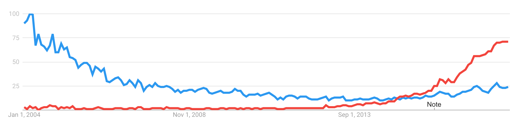
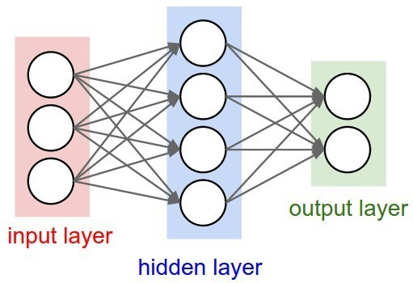

```{r, echo = F, message = F, warning = F}
library(tidyverse);library(magrittr);library(ggplot2);library(anytime);library(broom);library(stringr)
```


# Introduction

Welcome to the first of SUSA's crash courses on advanced data science in Python and R! In this tutorial, you will be learning about one of the most popular and versatile machine learning algorithms, **neural nets**, by using a package called **`Keras`** to implement a neural net model to recognize handwritten digits. We will be guiding you through an entire machine learning workflow, including exploratory data analysis (*EDA*), data cleaning, and the three components of modeling: **model training**, **model selection**, and **model evaluation**. We will even teach you a couple of neat tricks on how to visualize your models to understand their behavior and performance.

## About this Document
### Prerequisites
This workshop prerequires either experience in Python or R, to the degree covered by the previous [SUSA crash courses](http://github.com/SUSA-org/crash-course) - we recommend the completion of the introductory workbook series in both. This is partly to ensure you have the prior data wrangling and programming experience to understand the `Keras` code chunks at the end of this tutorial, but also to ensure you are caught up on the basics of machine learning practices covered incrementally in each workbook. At minimum, you should understand the purposes of **training** and **validation**, the difference between **classification** and **regression**, and the **bias-variance tradeoff**. You must have RStudio, Python, and R installed to run this notebook. Visit [py0]() for our crash course installation guide for Python. Visit [r0](r0.html) for general information on the philosophy and functionality of R and RStudio, as well as installation guides for both.

### adv-pyr1

This document contains textbook-style information on R and Python programming as applied to deep learning models. It will cover the entirety of a `Keras` implementation of a neural net to classify handwritten digits. 

Throughout this tutorial, you will be working with the [**MNIST dataset**](https://en.wikipedia.org/wiki/MNIST_database), a dataset of seventy-thousand images of handwritten digits. You will be using this dataset to train a model to recognize the written digit given a vector representing the image. More information on this dataset and its structure will be provided early in this tutorial.

Unlike some of the previous crash courses, this workbook will contain discussion and programming exercises throughout each section. These exercises are aimed at facilitating collaborative learning with your committee, and target the core concepts and extensions of the techniques covered in this tutorial.

# Understanding the MNIST Dataset

Take a brief moment to read over the [MNIST Wikipedia article](https://en.wikipedia.org/wiki/MNIST_database).


The MNIST dataset consists of 70k images, 10k of which are considered the **test set**, with the remaining 60k for **training**. Each data entry in the MNIST dataset is a $28\times28$ pixel image of a single handwritten digit, and each is **labelled** with the associated digit between $0$ and $9$. Our goal is to design a model that can be trained on the 60k training images and their labels, and then perform well in predicting which digit is represented in each test image.

#### Check for Understanding
> 1. Why is the MNIST dataset split into a **training set** and **test set**? Why do we want to avoid training our model on the test set? 
> 2. If we instead had 10k training images and 60k test images, how might that affect the performance of our model?
> 3. How many different **classes** are there in the MNIST dataset? 
> 4. Can you think of a particular pair of numbers that might be particularily difficult to differentiate, or prone to misclassification with each other? 

## Acquiring the MNIST Dataset

The MNIST data actually comes packaged with `keras`, a package which we will be using later to make our deep learning models, by default. So, let's install `keras` and take a look at the dataset.

## Installing `keras` in R

If you have `conda` installed on your machine (covered in [py0](https://raw.githubusercontent.com/SUSA-org/crash-course/master/Python/py0.html)), installing `keras` in R just takes a few short lines of code. 

First, you have to install the R package, `keras`, with the `install.packages` command. Unlike most R packages, which are self-contained, `keras` requires some extra libraries to run properly. So, after loading `keras` into your environment with the `library` command, you must take an additional step of installing all its dependancies using the `install_keras` command. In some cases, you may need to explicitly state the installation locations of `python` and `conda`. Fortunately, the `reticulate` package makes this easy, as you can check your installation locations with `py_discover_config`.

An example code chunk that installs `keras`, its dependancies, and then stores the MNIST dataset as `MNIST` is shown below:

```{r, eval=-c(1,5),message=F}
install.packages(c("keras", "reticulate")) ## NOT RUN on knit
library(keras);library(reticulate)
py_discover_config() ## Use this to discover your installation locations for conda and python
keras::use_python("/usr/local/bin/python3") ## As seen in the last line of the preceding output
install_keras()
MNIST <- dataset_mnist()
```

## Installing `keras` in Python

Please refer to the Python version of the notebook.


## The Structure of the MNIST Dataset

We've loaded `MNIST` into our environment, so let's take a look at its structure.
```{r}
str(MNIST)
```

As we can see from the output of `str`, `MNIST` is a list of two datasets, `train` and `test`. We can verify that the data entries `x` of `train` consist of $60,000$ images of $28\times28$ pixels in size. These entries come with matching labels `y`, one for each `x`. A similar setup can be seen for the $10,000$ entries in `train`. Each image is represented by a two-dimensional array of grayscale intensities ranging from $[0,255]$ to indicate the darkness of the ink at each pixel.

Let's split up our dataset into `training_set_*` and `test_set_*` variables for use in training and testing our model later.
```{r}
training_set_x <- MNIST$train$x
training_set_y <- MNIST$train$y

test_set_x <- MNIST$test$x
test_set_y <- MNIST$test$y
```

## Exploratory Data Analysis

This dataset is very clean, so there's not much to do in regards to EDA. However, it might help to visualize a few actual entries in our dataset, just so that we get a sense of its contents.

The initial structure of these images are two-dimensional arrays. However, with some transformation into a tidy form, we can use `ggplot2`'s `geom_raster` to plot a random image from our dataset like so:
```{r, echo = -1, warning = F}
set.seed(802)
random_image_id <- training_set_x %>% nrow %>% sample.int(size = 1)
random_image <- training_set_x %>% extract(random_image_id, , ) ## Extract all columns and rows of random image
knitr::kable(random_image, align = "c", caption = "Can you guess what number this is?")  
random_image_df <- random_image %>% data.frame %>% ## Cast as dataframe,
  mutate(Y = 28:1) %>% gather(X, `Grayscale Intensity`, - Y) %>% ## Add column for Y index
  mutate(X = str_replace(X, pattern = "X", replacement = "") %>% as.integer, ## Add column for X index
         `Grayscale Intensity` = `Grayscale Intensity` / 255) %>% ## Want our values to range [0,1] rather than [0,255]
  arrange(X, Y) 
str(random_image_df) ## Our dataframe of a single image is now tidy
random_image_df %>% ggplot(aes(X, Y, fill = grey(1 - `Grayscale Intensity`))) + geom_raster(interpolate = T) + 
  scale_fill_identity() + coord_fixed() + theme_minimal()
print(training_set_y %>% extract(random_image_id)) ## And sure enough, it's an 8
```

A human would immediately recognize this image as an $8$, but it's missing a lot of the features we would usually associate with $8$'s in general. Fortunately, our dataset contains hundreds of examples covering most writing behaviors and idiosyncracies - we hope that our model would be robust enough to recognize $8$'s and other numbers whether or not they follow the most conventional standards for handwriting.

## Data Cleaning

Since `keras` uses Python data structures, we cannot use the standard `dplyr` methods to clean our dataframe into a form more palettable for our `keras` model. Fortunately, the steps in data cleaning for the MNIST dataset are very brief. For our `x` datasets, all we have to do is flatten our two-dimensional $28\times28$ matricies into one-dimensional $28\times28=784$ vectors, and then change the units of the grayscale values to vary from $[0,1]$ rather than $[0,255]$ (*the reason for this [will be explained later](#an-introduction-to-activation-functions)*). For our `y` label vectors, we use `to_categorical` to *[one-hot-encode](https://www.quora.com/What-is-one-hot-encoding-and-when-is-it-used-in-data-science)* our labels - this command transform our scalars $y_i \in [0,9]$ into binary class matricies $y'_i$. 

```{r}
training_set_x %<>% array_reshape(dim = c(nrow(training_set_x), 784)) %>% divide_by(255)
test_set_x %<>% array_reshape(dim = c(nrow(test_set_x), 784)) %>% divide_by(255)

training_set_y %<>% to_categorical(num_classes = 10)
test_set_y %<>% to_categorical(num_classes = 10)
```

We're now all set to create a `keras` deep learning model to recognize handwritten digits! But first, let's cover some of the conceptual elements behind deep learning.

# Concepts in Deep Learning

Now that you've gotten a sense for the MNIST dataset, let's learn how to actually tackle this classification problem. 

## Handwritten Digit Recognition

To reiterate the structure of this particular machine learning problem, we have a **training set** of 60k images, each represented by a $28 \times 28 = 784$-dimensional vector of numeric grayscale values. Each entry $x_i$ in our training set also comes with a label, $y_i \in [0, 9]$, in one of ten categories. We want to craft a model that will use the vectors to guess the labels $\hat y_i$ accurately, such that our error metric (**root mean-squared error**) is not just low in the **training set** but also in the **test set** - we want to ensure our model doesn't **overfit** to the training set, which may not be representative of all digits. The task boils down to designing a model or algorithm that preforms robustly on classifying images of digits, by learning a ruleset from 60k examples.

#### Check for Understanding
> 1. Why is our model's accuracy with the training set an insufficient metric to judge our model by? What are the implications of not evaluating your model on the test set - which is separate from the data it was trained on?

Let's take a step back for a moment. If you had to devise a collection of rules to describe to someone why the following image is a $5$, what kinds of rules would you make? Which parts of the image make it apparent to you that it's a $5$ and not some other digit?
<center>
   
</center>
> 2. Take a few minutes with a partner to devise three rules completely describing why this image is a 5. What differentiates this image from an image of a 3, or a 7?

Even if you were able to make a successful ruleset to classify this particular image of a $5$, not all $5$'s are alike. Especially for numbers like $7$, which may have a cross through them or not, or $2$, which may have a looped tail or not, the rules quickly spiral out of reasonable specificity as we try to include more and more special cases to characterize how humans draw numeric digits.

In the past, difficult problems like image classification were met by *domain experts* who persisted through the difficulty of making these rulesets to **pre-process** data like ours into a form more interpretable by computers. Although it can be time-consuming, this process of manual **feature engineering** still remains a major component of data processing today.

Let's take our example of image classification. [In the $1950$s, two researchers recorded the responses of a cat as its retinas were stimulated by slides of large black dots.](https://www.youtube.com/watch?v=IOHayh06LJ4) However, they soon realized that it was actually the black edges of the slides that stimulated the cat's brain most, leading to evidence suggesting that our perception relies on **feature detection**, or the filtering of an image into lines (like the edge of a slide) and simple shapes, to make sense of visual input. Armed with this knowledge of human perception, we may collaborate with a linguist experienced in how humans write and perceive numbers to transform our dataset of images into a dataset of **features** better suited for a method like regression analysis. For example, we could **feature engineer** our images into vectors with values about where certain lines appear, or indicators of the precence of various shapes, before we attempt to fit a model to them. However, as our previous rule search proved, this task is quite difficult, and very complex problems resist manual feature engineering by humans. 

> 3. What are some examples of features our eyes might detect in images of numbers? 
> 4. Take a few minutes with a partner to fit your three rules into some sort of numeric representation (hint: a 3-dimensional vector of indicators or numeric encodings of features)

Instead, we could take inspiration from how humans percieve visual input in how we construct our model. The initial input to our sensory neurons is simply a collection of varying light intensities, but we learn to detect features of simple and complex shapes before making sense of the image itself. The complex problem of image classification is solved by processing the data in layers, going from raw inputs to features that begin to summarize the information in the data until we finally arrive at **recognition**. 

Similarily, in deep learning, we aim to design a model that, rather than requiring preprocessing of its input, learns how to *engineer its own features*. Our model would begin with the large vector of raw grayscale intensities, and process the data in **layers**, summarizing the data in steps to ultimately arrive at recognition. Although our model would start without any awareness about our training data, by incrementally feeding all of our training data into a model, and it would slowly learn the characteristics of each category. Taking note of the problem at hand, we must also ensure our model is complex enough to capture all the nuances in the data and its labels. We must also make sure that our dataset is large and well-labelled - with enough representative examples, the performance of neural nets is statistically guaranteed to arbitrarily approximate any supervised task. 

In the next few sections, you will learn about neural nets in more mathematical detail, but the mathematic structure of neural nets follows the intuition of incrementally transforming raw inputs into more and more descriptive features about the data.

## A Brief Review of Linear Algebra

## Neural Nets

If we consider all the methods in machine learning, **neural networks** are perhaps the most celebrated, overhyped, and least understood. Neural networks became famous (or infamous) due to their unprecedented performance combined with their mysterious nature. They achieve spectacular results but under the hood we cannot really explain what they are doing. We understand how to create them, train them, optimize them, and even visualize them in some cases, but we do not actually understand them. Because of this, many people immediately jump to the conclusion of "ahhh terminator!", but actually, neural networks have been known of since the $1940$s. The key algorithm in training neural networks, **back propagation** has been known since the $1990$s. We would argue that neural networks only exploded in the past few decades. So why are neural networks so popular now?

### Why Neural Networks now?
<center>

</center>
Above is a graph of google trends for neural networks and deep learning. Can you guess which color is which? Interestingly, neural networks is the blue line, and red is deep learning! Neural networks have been around for a while, and they have only recently become more popular due to new advances.

There are three main differences in machine learning now compared to $30$ years ago. 

1. More Data
2. GPUs (more computing power)
3. Better Algorithms

With time, we have been getting more and more data in all areas. The internet provides more images, text, audio than ever before. Now the issue is that we have more data than we know how to deal with. These huge data sets allow us train deeper models.
With GPUs and more computing power, we have the ability to process more data and manage previously infeasible models. We can now train those deeper models.
With better algorithms, our models are more efficient and effective. 

Interestingly, many people agree that the second difference is the most crucial to our recent developments in machine learning. We are now capable to parsing through gigabytes, terabytes, even petabytes of data for training models hundreds of layers deep. This simply was not possible $30$ years ago. Recent improvements in GPUs has allowed models to train and perform computations in parallel, greatly speeding up training process. 

### What are Neural Networks?
Neural networks derive their name from the neural network we have in our head, our brain. On a highly simplified model, our brain is a collection of *neurons* that receive electrical input signals from *dentrites*, output electrical signals via a single *axon*. Each neuron sends signals along a single axon and connects with other dentrites. Neural networks attempt to model this by having artificial layers neurons that perform minor tasks, then communicate from layer to layer.
<center>

</center>
Above is an image of the neurons and axons.
<center>

</center>
The circles represent nodes, and the arrows represent the communication between nodes. These are **feed forward** since the information propogates from the input on the leftside through intermediate calculations to a final output layer. Our goal in machine learning is to take some $x$ input to approximate some function $f^*(x)$. We are given $x,y$ pairs where $y\approx f^*(x)$, a rough approximation. These feed forward models attempt to model $f^*(x)$ by composing multiple functions together, such as $f^*(x)=f^{(2)}(f^{(1)}(x))$ in the neural network above. Notice that $f^{(1)}(x)$ is the middle layer in the model, but it is never used except in intermediate states, thus it is known as a **hidden layer**.

The beauty of neural networks is that they automatically determine the values of these intermediate functions and chain them together to approximate the function without any *a priori* knowledge. The neural networks for images, the early layers work with simple shapes like colors and edges, and work towards more complex textures, patterns, and finally to full objects. This stacking effect takes advantage of the numerous hidden layers and creates complex features from combinations of simple ones.

### How do Neural Networks work?
<center>

</center>
Above is an image of a zoomed in individual neuron. In this case, we have a single neuron, with multiple inputs. The general idea is to take all the inputs to the neuron from various dentrites, sum them, and perform some function on the sum. We also have a certain weight to each dentrite, so it is a linear combination of the inputs. There are many valid possible functions to perform at the end, known as *activation functions*. We will go into these in the next section.

To delve more into the math, each neuron outputs a specific value, denoted as $x_i$. This neuron then has separate weights for each further neuron it connects to, and multiplies each weight to $x_i$ to serve as the input to a new neuron deeper in the model. In the image above, we have three inputs $x_0,x_1,x_2$ from three neurons. Each individual arrow from neuron to neuron has a unique weight, and each weight gets multiplied by the output axon value from the neuron. To determine the output of the blue neuron, we take the sum of the $x_iw_i$, then apply some activation function $f$. This gives us $f\left(\sum_i w_ix_i + b\right)$. The added $b$ term is not too important, essentially we also include a bias term, a constant value we add. 

#### Check for Understanding

> 1. How many weights are in the three layer neural network image above (not counting biases)?
> 2. What happens if we use a linear activation (such as $ax+b$)?

## An Introduction to Activation Functions
To answer the second question above, consider each activation function in the neural network to be linear of the form$f^{(i)}(x)=a_ix+b_i$. Then if we compose many of these linear functions together, we would get some $f(x)=f^{(n)}(f^{(n-1)}(\ldots f^{(1)}(x)\ldots ))=ax+b$ for some $a,b$. Since the composition of linear functions is a linear function, then we essentially will conduct linear regression. Without nonlinearities, our model can only do as well as linear regression. So what activation functions can we use instead of linear functions?

There are many common activation functions. 
<center>


 Rectified Linear Units (ReLU) $\max(0,x)$
</center>

Rectified Linear Units (ReLU) is one of the most common activation functions used. It is simply the function $\max(0,x)$, essentially thresholding at zero. 
<center>


Sigmoid $1/(1+e^{-x})$
</center>

Sigmoid is also very commonly used as an activation function. It has the unique property of approaching $0$ as $x$ approaches $-\infty$, approaching $1$ as $x$ approaches $\infty$, and $1/2$ at $0$. This gives an inherent probability mapping from $(-\infty,infty)$, where the larger the value of $x$ the higher the probability.

<center>


 Hyperbolic Tangent (Tanh) 
</center>

Tanh has many advantages over sigmoid since the activation function is centered at zero, and can output negative numbers. In practice, tanh is preferred over sigmoid. 

## How Neural Networks Learn

The general idea in machine learning is given a model and dataset, we would like to minimize the loss or error on the model. The general idea is to tweak the weights of the neural network as we train on data to predict the misclassified numbers better. This leads us to two major questions, what is the **loss function** of our model, and how do we update the weights of our model?

### Loss Function for Classification
We could have the loss be $0$ for correctly classifying the number, and $1$ for incorrect classification. However, this is a bit naive because we lose a lot of information on what the correct answer is. A better loss function for classification is **cross entropy loss**. The formula may look a bit complex but the idea is simple:
$$-\sum_i y_i \log {\hat {y}}_i$$
The $y_i$ represent the distribution for the current image. If the current image is a $3$, then $y_3=1$ and $y_i=0$ for all $i\neq 3$. The $\hat y_i$ represent the probability distribution outputs from our model. We may classify the image with $20%$ for $1$, $30%$ for $2$, $50%$ for $3$, and $0%$ for the rest. The error would be $-\log(.5)$.

The key thing to notice about the cross entropy loss is that the loss drastically increases as probability for the correct label approaches zero. If we output a very low probability for the correct class, the logarithm approaches very large negative values, resulting in a large loss. On the other hand if we output a very high probability close to $1$ for the correct class, the loss is almost zero since $\log 1 = 0$.


### Back Propagation

Back progagation is the key to training neural networks. To explain back propagation, we may begin with an analogy. Consider that today after eating, you get a bad stomach ache and suspect that you got food poisoning. A logical step would be to assign blame to the most recent foods you ate, placing more blame on the more suspect foods such as raw fish, raw meats, etc. We intuitively place the blame on the more recent things, then may consider the causes farther back such as the leftover salad you left in the fridge for a week or the spoiled milk from that boba place you knew you shouldn't have gone to. 

Back propagation is similar, we distribute the loss through the model beginning with the layers closer to the output, and propage the loss back. The exact math is a bit complex as it involves a lot of derivatives, but the general idea is relatively simple. The more suspicious or the more the neuron contributed to the incorrect prediction, the more we penalize it to be correct. 

# `Keras` in Python
Please refer to the Python version of the notebook.

# `Keras` in R

```{r}
model <- keras_model_sequential() 
model %>% 
  layer_dense(units = 256, activation = 'relu', input_shape = c(784)) %>% 
  layer_dropout(rate = 0.4) %>% 
  layer_dense(units = 128, activation = 'relu') %>%
  layer_dropout(rate = 0.3) %>%
  layer_dense(units = 10, activation = 'softmax')
```


# Conclusion

This ends our textbook-style primer into deep learning with Keras. While this was just an introduction in nueral nets, we hope that you can now see some of the workflow patterns associated with machine learning. Feel free to play around with the code above to get a better feel for the hyperparameters of the neural net model. As always, please email [`contact@arun.run`](mailto:contact@arun.run) or [`prc@berkeley.edu`](mailto:prc@berkeley.edu) with any questions or concerns whatsoever. Happy machine learning!

## Sneakpeek at SUSA Kaggle Compeition

After Spring Break, we will be guiding you through a four-week collaborative Kaggle competition with your peers in Career Exploration! We want to give you the experience of working with real data, using real machine learning algorithms, in an educational setting. You will have to choose either Python or R, and dive into reading kernels on the Kaggle website, use visualization and feature engineering to improve your score, and maybe even pick up a few advanced deep learning models along the way. If this sounds a bit intimidating right now, do not fret! Your SUSA Mentors will be there to mentor you through the whole thing. So rest up during Spring Break, and come back ready to tackle on your biggest data challenge yet!

# Additional Reading
* This workshop was based on the introductory example for [Keras in R](https://blog.rstudio.com/2017/09/05/keras-for-r/). For more information on the R `keras` package, visit the following websites:   
    - The official RStudio website for [Keras](https://keras.rstudio.com) contains a shortened version of the MNIST illustrative example, a textbook reference, and more  
    - For a few examples on how to implement sequential neural networks like the one used in this tutorial, visit the [Keras guide to sequential models in R](https://keras.rstudio.com/articles/sequential_model.html)  
    - The official [FAQ for Keras in R](https://keras.rstudio.com/articles/faq.html) contains tons of useful information, like the differences between a **sample**, **batch**, and **epoch** as well as useful and easy one-liners to improve or validate your models
* For an interactive guide to learning R and Python, visit [DataCamp](https://www.datacamp.com/) a paid tutorial website for learning data computing.
