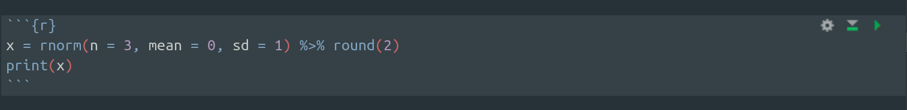

# Introduction

In this first tutorial on R, you will learn about how to actually use R to work with data, as well as the core concepts behind R programming. You will learn the basics of R syntax as well as several functions in base R. Finally, you will grow familiarity with **R Markdown**, especially as you work within the [r1-workbook](r1-workbook.html) associated workbook. 

## About this Document
### Prerequisites
The only prerequisite for this tutorial is [r0](r0.html). You will need to install both R and RStudio to use the [r1-workbook](r1-workbook.Rmd) associated workbook. Visit [r0](r0.html) for general information on the philosophy and functionality of R and RStudio, as well as installation guides for both.

### r1
This document contains textbook-style information on R programming. It will cover the essentials of both base R and a few packages such as `magrittr` and `stringr`.

### r1-workbook
The [r1-workbook](r1-workbook.Rmd) contains associated exercises to work through as you learn about the concepts within this document. They are aimed to help you get practice and familiarity with R programming concepts and functions. At the end of each section of this document, solve the problems in the matching section of the workbook to help your understanding of the material.

# R Markdown
The associated workbook requires some knowledge of R Markdown to use.

**R Markdown** is a powerful way to combine text, code, code output, images, LaTeX, and web elements into a single document, report, slide deck, or website. R Markdown is a file format and markup language that allows you to **knit** together `Rmd` files, which can either be *interactive* (as **notebooks**), or *published* (like this `html` document). It allows you to break up your code into bite-sized **code chunks**, surrounded by (optionally marked up) text. See the [Additional Reading](r1.html#additional-reading) section at the end of this document for more information on how to make your own beautiful reports and workbooks in R! As R Markdown documents are standalone and work regardless of the computer that opens them, they are the best way to edit and share statistical code.

At the very core of the notebook philosophy is the **code chunk**. To make a chunk in RStudio, simply type three backticks, `{r}`, and then three more backticks when you are finished writing your code chunk. An example of the chunk syntax is below:
 

# Base R 

Base R (known as the `base` package internally) contains hundreds of functions by default to jumpstart your data analysis workflow. We will go over the syntax of R, as well as some of these functions.

## Basic R

### Syntax Basics
R is *case-sensitive*. So, ensure that you are always using the correct capitalization when dealing with functions, variables, and dataframe column names. 

Additionally, every command is separated by a new line, or a semicolon if you want to make multiple commands on a single line.

Finally, you can comment code with \#, which requests that R ignore the entire rest of the line, and treat it as normal text in the output. 

### Expressions
You can do basic arithmetic in R without the need of more advanced **functions**. These operations include the EMDAS (`^`, `*`, `/`, `+`, `-` respectively) operators, as well as the modulo/remainder operator (`%%`). Some examples are below:
```{r}
2 ^ 3
4 * 4
5 / 10
3 + 3
7 - 6
8 %% 6
```

We can also use the equality operator (`==`) and the inequality operator (`!=`), as well as operators like greater-than (`>`) and less-than-or-equal (`<=`) to **test** values. (To **test** means to return `TRUE` in some cases and `FALSE` otherwise). Some examples are below:
```{r}
4 > 4
4 >= 4
4 == 4
4 != 4
```

Note that spaces between operators and operands are optional, but may improve readability. 

### Variables & Assignment
In R, a **variable** is an object that stores a value of some sort. After assigning a variable an initial value, you can re-assign it as many time as you'd like, even changing the type of object it stores. 

The most basic way to assign a variable a value in R is to use the `=` operator, which sets a variable to the value to its right. However, you can also use the **arrow operator** to set variables on either the left or the right of the value. 

As such, the following are equivalent:
```{r}
a = 1
a <- 1
1 -> a
```

After you have set a variable, you can print its value using `print`. Alternatively, you can just type the variable to see its value.
```{r}
print(a)
a
```

Once you have set a variable, you can use it in arithmetic! For example, let's emulate the Pythagorean Formula.
```{r}
a <- 3
b <- 4
c <- sqrt(a^2 + b^2)
c
```

Normally, R will not let you start a variable with a number or include any spaces in your variable name. To get around this, surround your variable with backticks.
```{r}
`5 and a space` <- 420
print(`5 and a space`)
```

### Atomic Objects

An **atomic object** in R is an object or list of objects that are both **flat** (cannot be reduced or opened further) and of the same **type**. 

There are three **types** in R - we will be going over their properties individually, before discussing **vectors**, which are collections of atomic objects. To check the type of an object, use the `class` function:
```{r}
class(1.23)
```


#### Types 
##### Numerics

A **numeric** is an atomic object that refers to integers, doubles (*decimals*), and more. 

Some examples are below:
```{r}
13
013
0130
1.30
13e-1
```

R also contains the constant `pi`, which evaluates to 3.141593.

##### Logicals

A **logical** is a quantity that evaluates to either `TRUE` or `FALSE`. Recall the (in)equality testing we reviewed above - the output of these operators are logicals.

Any non-zero numeric evaluates to `TRUE`. You can also use `T` and `F` rather than `TRUE` and `FALSE`, respectively.

The **boolean operators** in R are operators that have logicals as operands. There are three basic ones:   
- `|` the binary OR operator, which returns `TRUE` if either of its arguments are `TRUE`   
- `&` the binary AND operator, which returns `TRUE` if both of its arguments are `TRUE`   
- `!` the unary NOT operator, which returns the opposite of its logical operand

##### Characters

A single lexographical symbol or **string** of multiple symbols is of type **character**. To make a string, surround one or more symbols in double-quotes (or alternatively, in single-quotes). A string does not evaluate its contents, and so `"TRUE"` and `"123"` are distinct from `TRUE` and `123`. Observe the functionality of various basic string syntaxes and functions below:
```{r}
str <- "susa"; nchar(str)
str2 <- "1.2"; str2 == 1.2
str3 <- paste("Statistics", "Undergraduate", "Students", "Association"); print(str3)
```

#### Vectors

A **vector** is an ordered finite sequence of elements, each of the same type. Just like the atomic objects it contains, a vector is also considered an atomic object\*. As such, they must be both **flattened** (fully reduced) and of the **same type**.  Vectors are an important building block in R, as they compute quickly and are a way to bind together multiple values. 

\*(*In fact, singleton values are just single-element vectors in R.*)

##### Vector Basics

To construct a vector, we use the `c` function, which stands for *concatenate*, as it can also add more values to the vector. You can also use the `:` notation to make ordered sequences of numbers. Finally, you can check the length of a vector using `length`. Observe these behaviors below:
```{r}
vec <- c(1,2,3,4)
vec2 <- 1:4
print(vec)
length(vec2)
vec == vec2
```

##### Vectorized Functionality

Notice that operators (e.g. `==`) function on vectors *element-wise*. This is an example of R's **vectorization** behavior. Essentially, R will try to take basic operators and functions and apply it to each element in a vector automatically, then return the resultant vector. Because of vectorization, vector operation in R is efficient. Here are some examples of vectorization in R:
```{r}
v <- c(1, 12, 169, 7)
1/v
2*v^2 - v + 3
```


##### Flattening

Recall from the previous section that atomic objects are always *flattened*. That is, they cannot contain non-atomic objects. When you combine two vectors in R with `c`, they will automatically become one long vector, rather than a 2-element vector of two vectors. To better illustrate this, observe the following examples of *flattening*:
```{r}
v <- 1:5
c(1,2,3,v)
c(1:3, v)
w <- c(v, v)
length(w)
w
```

An example of both properties of atomic objects (*flattening* and *same-typeness*) is that R will automatically **cast** elements of different types to be the type. Logicals will turn into numerics, and both numerics and logicals will turn into strings if R has to convert them to retain *same-typeness*. Consider the following example of this behavior:
```{r}
a <- c(T, F)
c(a, 3)
c(a, "TREE")
```

##### Subsetting Vectors
All vectors are **indexed** (labeled by number) so that you can access them by telling R which elements you want. The indicies are *1-indexed* - i.e. the first element is labeled `1`, the second `2`, and so on. You can specify which elements with square brackets. Finally, you can tell R to *exclude* rather than *select* the indices you pass to it using `-`. Observe the following behaviors:
```{r}
v <- c("red", "blue", "green")
v[1]
v[2]
v[1:2]
v[-2]
v[-c(3,1,2)]
```


Alternatively, you can specify an inclusion indicator for each element by giving a vector of logicals. Observe the following behaviors:
```{r}
v <- 1:5
v[c(T, F, F, F, T)]
v[! c(T, F, T, F, T)]
```

Finally, if you set **names** for the elements of your vector, you can access the elements in your **named vector** by giving which specifying you want. Observe the following behaviors:
```{r}
v <- c(one = 1, two = 2, three = 3)
v["one"]
get_these <- c("one", "three")
v[get_these]
```

### Lists

Now let's learn a few *non-atomic* objects. A **list** is an ordered sequence of values of *flexible type*. In comparison to vectors, lists are unconstrained in what they can contain. Their elements can be of different type or even be vectors or lists themselves! To access elements of a list, use single square brackets to get a sublist, or **extract** a single value with double bracket.s Observe the following behaviors:
```{r}
vec <- 3:1
l <- list("SUSA", vec, c(F, T)); l
length(l)
l[2] #[] returns a sublist
l[2:3]
l[[2]] #[[]] returns the item within the list
```

### Functions

Now that you've learnt some of the basic data structures in R, let's learn some of the **functions** that operate on them! A **function** is a device that accepts zero or more input **arguments** and yields single output, or **result**. Unlike the binary and unary operators (e.g. `+`, `==`, etc.) we've been reading about, functions have the following usage syntax: `f(x,y)`, just like functions you study in math class.

#### Using Functions

Let's learn a couple of functions that should help illustrate how functions work in R. First up, we have the `sqrt` function, which simply finds the square root of its argument. Observe the following behavior:
```{r, message = F, warning=F}
sqrt(4)
sqrt(23)
real_negative = -1; sqrt(real_negative)
complex_negative = as.complex(-1); sqrt(complex_negative)
```
*Notice that `sqrt(-1)` returns `NaN`("Not a Number") for real -1, but returns i for complex -1.*

To check how a function works in R, simply type e.g. `?sqrt` in your console. The associated documentation for the function you searched will open up in the Help pane. You will see a **Description** section, which discusses the function's purpose in English; a **Usage** section, which shows you the right syntax to use the function; a **Arguments** section, which details what kinds of objects will be accepted as arguments; a **Details** section, which explains special cases and considerations; and an **Examples** sections which gives example code segments on how to use the function in question.

Some functions have **default values** for some arguments. For example, if you type `?log`, you will see information on R's log function. Notice that the default base is `base = exp(1)`. That is, if we use `log` in R, by default it will take the natural log. If we wanted to change the base, we could specify it as something else than its default value. Finally, note that many functions in R (e.g. `log`), also support vectorization. Observe the following examples:
```{r}
tens <- 10^(1:10)
log(tens)
log(tens, base = 10)
log(tens, base = 2)
```

#### Writing Functions

To write your own function in R, we will use curly brackets, the `function` function, and the `return` function. For example, to make a function `square` that returns the 2nd power of its inputted argument, we can run:
```{r}
square <- function(x){return(x^2)}
```
Then, we can use the `square` function anytime we wish. Since the contents of the `square` function uses the vectorized operator `^`, our `square` function is vectorized too.
```{r}
square(12)
square(1:10)
```
Suppose we also wanted to make a more general function `power`, that will raise a number to the $n^{th}$ power, but default to just squaring a number. We could write it as so:
```{r}
power <- function(x, n = 2){return(x^n)}
```
Observe the following behaviors of our handmade function:
```{r}
power(12)
power(12, n = 5)
power(1:10)
power(1:10, n = 1/2)
```

Finally, if you want to use multple functions together, you can **compose** them just like you do in math (e.g. `f(g(x))`). We will later learn about a package called `magrittr` that makes reading function compositions much easier. Observe the following examples:
```{r}
sqrt(square(12))
sqrt(power(12))
sqrt(power(12, n = 3))
```

## Dataframes

Now that we've learnt about vectors, lists, and functions, we are ready to learn about the most essential object for data analysis: the **dataframe**. A dataframe is a list of (named) vectors, all of the same length.

### Constructing Dataframes
For example, let's suppose we wanted to make a dataframe of a group of friends, with their ages and favorite colors. First, we would make a vector of their names, a vector of their ages, and a vector of their favorite colors. Notice that these vectors are of different types, but all contain exactly 3 elements:
```{r}
friends <- c("Hadley", "Mom", "R"); class(friends)
ages <- c(30, 45, 18); class(ages)
fav_colors <- c("Pink", "Yellow", "Blue"); class(fav_colors)
```

Then, we can combine these into a dataframe, or list of named vectors, using the `data.frame` function. Alternatively, we can first make a list of vectors, and then give it as an argument to `data.frame` to acheive the same thing:
```{r}
my_friends <- data.frame(Name = friends,
                         Age = ages,
                         `Favorite Color` = fav_colors, check.names = F)
print(my_friends)
my_friends_2_precursor <- list(Name = friends, Age = ages, `Favorite Color` = fav_colors)
my_friends_2 <- data.frame(my_friends_2_precursor, check.names = F)
# my_friends is identical to my_friends_2
```
R has constructed a dataframe called `my_friends` with three column vectors, `Name`, `Age`, and `Favorite Color`. We can check the **structure** of our dataframe with the `str` command, which details the number of **observations** (*rows*) and the number of **variables** (*columns*), as well as the type of each:
```{r}
str(my_friends)
```
Notice that `data.frame` converted our string vectors (`friends`, `fav_colors`) into factor vectors. A **factor** is a new type that refers to categorical data with a finite number of categories. R prefers to work with factors, as it makes checking equality and sorting faster than if it had to parse strings. R will implicitly convert strings into factors, unless you ask it not to by specifying `stringsAsFactors=FALSE` in the function call of `data.frame`.

### Subsetting Dataframes
To extract a specific vector back out of a dataframe, use `$` notation. Alternatively, you can use the standard list double square-bracket notation:
```{r}
vec <- my_friends$Name
print(vec)
vec2 <- my_friends[[1]]
vec == vec2
```

Finally, you can **subset** your dataframe to return a new dataframe with only particular columns or rows with the single square-bracket notation:
```{r}
my_friends[1, ]
my_friends[, 3]
my_friends[1,3]
```

## RDS Files

An **RDS** (*R Data Structure*) is the most efficient way to make your dataframes portable. It simply packages whatever object you pass to the `saveRDS` function in a memory-efficient way, and then you can Slack, email, or share your object, and another person can read it in R with `readRDS`.

# Installing & Using Packages

We've now covered a fair amount of base R. We could keep going and learn more, but there are actually packages that accomplish a lot of the things in base R more easily. Next, we will learn how to install and load packages, and then learn about two of the most popular ones: `magrittr` and `stringr`.

A **package** is an addition to the base libraries in R. Some packages contain multiple smaller packages. Packages are easy to install and quick to load in R.

## Installing Packages

The first time you use a package, you will need to install it first. Use the `install.packages` function to do this. Let's install the `magrittr` and `stringr` packages.
```{r, eval = F}
install.packages(c("magrittr", "stringr"))
```

After you've installed it the first time, the package will remain downloaded on your machine. Then, you just need to call `library` each time you re-open R to use the functions from that package. Let's load up `magrittr` and `stringr` for use in the next two sections. 
```{r}
library(magrittr)
library(stringr)
```

## `magrittr`

`magrittr` is a package that allows you to use **piping** in R. Piping is a way to make your code more readable. Essentially, it allows you to compose functions as `x %>% f %>% g` rather than using `f(g(x))`. The symbol for pipe is `%>%`. Since piping reads left-to-right rather than the usual in-to-out, it is more readable and makes your code easier to manage. Observe the following syntax:
```{r}
sqrt(power(123, 3))
# is equiv. to...
123 %>% power(n = 3) %>% sqrt
```

You can also use `magrittr` to use functions rather than the equivalent operator, again making your code easier to read. To view all the aliases, type `multiply_by` in your R console. Observe the following example:
```{r}
(((30 + 6) / 4) %% 3) > 0
## is equiv. to...
30 %>% add(6) %>% divide_by(4) %>% mod(3) %>% is_greater_than(0)
```

Finally, you can use `magrittr` for variable assigment, after running a variable through a lot of functions, using `%<>%`. Observe the following behaviors:
```{r}
a = 64
a <- a %>% divide_by(4); print(a)
# is equiv. to
a %>% divide_by(4) -> a; print(a)
# is equiv. to
a %<>% divide_by(4); print(a)
```

## `stringr` 

`stringr` is a package used for text and string manipulation in R. We will learn it to gain more familiarity with functions, as well as ease into the `tidyverse`, which we will learn more about next week.

### `str_length`

`stringr`'s `str_length` function returns the number of characters in a string. Observe the following examples:
```{r}
x <- "asdf"
str_length(x)
str_length(c(x, x, "asdfgh"))
str_length(NA)
```

### `str_sub`

The `str_sub` function extracts a substring from a string, given a start and end index. Using negative values for the index indicates that you'd like to count the index from the *back* of the string rather than from the *front*. Observe the following examples:
```{r}
x <- "SUSA is awesome!"
x %>% str_sub(start = 2, end = -2)
x %>% str_sub(1, 4)
x %>% str_sub(3, 3)
```

We can also use `str_sub` to edit a substring of a string. Observe the following example:
```{r}
str_sub(x, 1, 4) <- "ggplot"
x
```

### `str_trim`

You can easily **trim** off the whitespace at the beginning or end of a string using `str_trim`.  Observe the following example:
```{r}
x <- "    there are unecessary spaces here    "
str_length(x)
trimmed_x <- str_trim(x); trimmed_x
str_length(trimmed_x)
```

### `str_detect`

You can search a vector of strings for a search pattern using `str_detect`. Observe the following example:
```{r}
x <- c("Hello world", "#SUSA magic", "#careerexploration", "no hashtags here", "#hashtag"); x
str_detect(x, pattern = "#")
```

### `str_replace`, `str_replace_all`

You can replace all the matches to a particular pattern with a replacement pattern using `str_replace_all`. In contrast, `str_replace` will only replace the first instance of a pattern per string. Observe the following example:
```{r}
x <- c("susa", "pythons suck", "r > python > stata")
str_replace(x, pattern = "py", replacement = "mara")
str_replace_all(x, pattern = "s", replacement = "S")
```

This concludes our brief overview of `stringr`. `stringr` includes many other very useful functions, so consult the [Additional Reading](#additional-reading) section below if you wish to learn more. 

# Sneakpeek at `r2`
Next week, we will be covering data cleaning and other data science tools in R. You will learn how to **tidy** your data using the `tidyverse`, a set of packages designed to make data wrangling in R as rapid and painless as possible. `tidyverse` actually contains `stringr`, so you're already on your way in learning these tools in R! You will also learn a little bit on how to scrape data from the web.

# Additional Reading
- For a cheatsheet on Base R, visit RStudio's [Base R Cheat Sheet](https://www.rstudio.com/wp-content/uploads/2016/05/base-r.pdf).
- For more information on R Markdown, visit the [R Markdown quick reference guide](https://www.rstudio.com/wp-content/uploads/2015/03/rmarkdown-reference.pdf).  
- For a quick intro on the `magrittr` package, visit the [magrittr vignette](https://cran.r-project.org/web/packages/magrittr/vignettes/magrittr.html).
- For more information on the `stringr` text manipulation package, visit the [stringr vignette](https://cran.r-project.org/web/packages/stringr/vignettes/stringr.html).
- For a quick introduction to regex, visit [this guide](https://www.maketecheasier.com/the-beginner-guide-to-regular-expressions/).
- The premier free online textbook for R, written by one of the leading developers of the R ecosystem, ["R for Data Science" can be found here](http://r4ds.had.co.nz/).
- The follow-up textbook to ["R for Data Science"](http://r4ds.had.co.nz/), ["Advanced R", can be found here](http://adv-r.had.co.nz/).
- For a detailed official guide on R, see the first three manuals on [this CRAN page](https://cran.cnr.berkeley.edu/manuals.html).
- For an interactive guide to learning R and Python, visit [DataCamp](https://www.datacamp.com/) a paid tutorial website for learning data computing.
