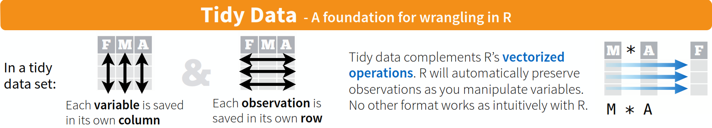

# Introduction

In this second of SUSA's crash courses on R, you will learn about how to actually use R to conduct data analysis, or more appropriately, how to *clean* your data to prepare them for data analysis. You will continue your foray into R packages with this primer on `tidyverse`, a collection of packages meant to make data science in R rapid and painless. In particular, you will learn how to use `dplyr` and `tidyr` for data cleaning, `readr` and `readxl` for data import, and finally an introduction to R's functional tools, with the `*apply` function family and the `map` and `reduce` functions from the `purrr` package.

## About this Document
### Prerequisites
The immediate prerequisite this tutorial is [r1](r1.html). You will also need to install both R and RStudio to use the [r2-workbook](r2-workbook.Rmd) associated workbook. Visit [r0](r0.html) for general information on the philosophy and functionality of R and RStudio, as well as installation guides for both.

### r2
This document contains textbook-style information on R programming. It will cover the essentials of several `tidyverse` packages such as `dplyr`, `tidyr`, `readr`, `readxl`, and `purrr`.

Throughout this tutorial, you will be working with three distinct datasets, to give you familiarity and practice with the `tidyverse`. These datasets are as follows:

1. `iris`, the Edgar Anderson's classical multivariate dataset on 150 flowers in a Canadian field. This dataset will be used to illustrate `dplyr`, `tidyr`, `purrr` functions.
2. `articles`, an unclean dataset of Wellcome Trust's open access spend from 2012 to 2013. This dataset will be used to give readers practice with `dplyr` and even [`r1`'s `stringr` section](r1.html#stringr).  
2. `plant-ants`, an untidy matrix of plant-ant interactions recorded in 1996. This dataset will be used to give readers practice with `tidyr` and `readxl`. 

### r1-workbook
The [r2-workbook](r2-workbook.Rmd) contains associated exercises to work through as you learn about the concepts within this document. They are aimed to help you get practice and familiarity with R programming concepts and functions. At the end of each section of this document, solve the problems in the matching section of the workbook to help your understanding of the material.

# The `tidyverse` Ecosystem

Before we begin learning about the various packages contained within the `tidyverse` collection, it's important to conceptually understand what `tidyverse` aspires to do.

## Introduction

According to the [official website](https://www.tidyverse.org/),  

> The tidyverse is an opinionated collection of R packages designed for data science. All packages share an underlying design philosophy, grammar, and data structures.

Let's unpack this a little. The `tidyverse` is a collection of R packages. These R packages all share the same underlying data structures, grammar, and philosophy, and so are designed to *work well together*. Finally, the `tidyverse` is designed for data science. It aspires to make data science in R rapid, intuitive, and cohesive. 

As you will see throughout the rest of this tutorial, the packages in the `tidyverse` each cover separate areas of data science, but work so well together that you will find yourself tying them together into a single seamless workflow. This natural tendency to begin piping `readr` commands into `dplyr` commands into `broom` commands into `ggplot2` commands (the list could go on and on!) is exactly an artifact of the underlying philosophy and grammar pioneered by the `tidyverse`. 

> The bottom-line: The tidyverse is designed to make data science as human as possible.

## Installation

Installing every package in the canonical `tidyverse` takes only a single command:
```{r, eval = F}
install.packages("tidyverse")
```

From there, you can load the `tidyverse` packages into your work environment with:
```{r, message=T}
library(tidyverse)
```

Notice the output message, which tells you which specific packages of the tidyverse were loaded. 

# Data Wranging

The first general topic we will cover in this tutorial is **data wrangling**. **Data wrangling**, or manipulating dataframes, has two components: **data cleaning** and **tidying**. While you may wrangle your dataframe for a variety of purposes (e.g. changing the units of your variables or selecting only part of your dataset), they usually fall into one of those two broader categories. 

Unfortunately for all data scientists, statisticians, and machine learning specialists, in the wild, real datasets are ugly. There are missing values, random whitespace where you would never guess it, typos, annoying header cells, and more! You cannot analyze or even visualize your data while it's still "dirty". **Data cleaning** is the process of massaging your data into an error-free form (usually tidy) that works best for your analysis. As you'll soon learn in your Statistics career,

> 80% of your time working with data is spent cleaning.

*Cleaning* data is one thing (hint: `dplyr`'s got your back!), and involves a lot of time and care, but *tidying* data is still more stringent. As you'll learn next week in `r3`, the `tidyverse` runs on **tidy data**. Its functions are optimized to work seamlessly with any clean dataset, as long as the dataset is tidy.

A **tidy dataset** has two (loose) properties:  

1. Every observation is a single row.
2. Every variable is a single column.


While interpretations of **observation** and **variable** vary, it helps to know that tidy data is the antonym of **wide data** - tidy dataframes tend to be longer, rather than wider. For example, if you're working with a monthly-resolution time series of restaurant sales data, the **wide** dataset would have a row for each year, and a column for each month. The **tidy** dataset equivalent would have three columns: one for the year, one for the month, and one for the sales for that month. 

A diagram of tidy data, from RStudio's [Data Wrangling](https://www.rstudio.com/wp-content/uploads/2015/02/data-wrangling-cheatsheet.pdf) might be useful:


Just as the `dplyr` is specialized for manipulating data, The `tidyr` package is specialized to take cleaned data and output its tidy equivalent. Without further ado, let's learn how to use these powerful `tidyverse` packages!

## `dplyr`

`dplyr` is the `tidyverse` package for data manipulation. First, let's do a quick review of dataframes with the simple functions to help view data.

### `head`, `View`, `arrange`

The `head` function is useful to just see the first few entries of a dataframe. Let's use `head` to print the first six lines of `iris`, one of R's default datasets. 
```{r}
head(iris)
```

If you look at the documentation for `head` with `?head`, you can verify that the default number of lines outputted is 6. 

Rather than printing the dataframe to the console, the `View` function will open up a new pane in RStudio to view your dataframe as a spreadsheet. This pane is filterable and searchable, so it's useful to quickly glance through large datasets! Let's view our iris dataset in full:
```{r}
View(iris)
```

Although you can sort your dataset in the View pane, suppose you want to sort your dataframe before using `head` to see the first six entries *by some column*. This is where `dplyr`'s sorting function comes in, `arrange`. By default, it will arrange your dataframe from least to greatest of some column variable. For example, let's check the shortest petals in the `iris` dataset:
```{r}
iris %>% arrange(Petal.Length) %>% head
```

If we wanted to check the **longest** petals instead, we would run:
```{r}
iris %>% arrange(desc(Petal.Length)) %>% head
```

`arrange` is the first of the `dplyr` functions we've learned. Now that we're warmed up, lets tackle the rest.

### Dataframe Subsetting

One of the most essential operations in data science is to select some subset of either the columns or the rows of a dataset. 

#### Row Selection (`sample_*`, `slice`, `filter`)

First, we'll learn how to select only certain rows in a dataset, either randomly, by row number, or according to a logical expression.

##### `sample_n`, `sample_frac`

To randomly select a few rows from your dataset, use `sample_n`, which takes a dataframe and a number of entries to sample. There's also `sample_frac`, which takes a dataframe and a fraction of the size of the dataframe to sample. Observe the following behaviors:
```{r}
iris %>% sample_n(size = 5)
## NOTE: iris has 150 entries. 33% of 150 is ~50.
iris %>% sample_frac(.33) %>% nrow
iris %>% sample_n(50) %>% nrow
```

##### `slice` 

To select a row by its row number, we used the `slice` function. `n` is a helper function that returns the number of entries in whatever is passed to the function it is used in. Observe the following behaviors:
```{r}
iris %>% slice(c(1,2,3,100,150))
iris %>% slice((n() - 3):n())
```

##### `filter`

What if you wanted all the entries in your dataframe that satisfied certain properties? `filter` is a `dplyr` verb that takes in a dataframe and any number of logical expressions about the dataframe's columns. Observe the following behaviors:
```{r}
iris %>% filter(Sepal.Width < 2.5)
iris %>% filter(Sepal.Width < 2.5, Species != "versicolor")
```


#### Column Selection (`select`, `rename`, `pull`)

Next, we'll learn how to `select` specific columns, rather than rows, of our data. We will also learn how to `rename` columns, and how to extract singular columns as vectors rather than sub-dataframes with `pull`.

##### `select`

`select` accepts a dataframe and a list of columns, and returns a new dataframe with just those columns. Observe the following behaviors:
```{r}
iris %>% select()
```


##### `rename`

##### `pull`

### Adding & Modifying Columns (`mutate`, `transmute`)

#### `mutate`

#### `transmute`

### `summarize`, `summary`

### Grouped Data

#### Grouped `summarize`

#### Grouped `mutate`

### Combining Datasets

#### Binds

#### Joins

## `tidyr`

### `gather`

### `spread`

### NA Values

#### Using `tidyr` (`drop_na`)

#### Using `dplyr`

# Data Import 

## `readr` & `readxl`

## Column Types

# Functional Programming in R (`purrr`)

**Functional programming** is the paradigm that relies on applying **functions** to **elements** in multi-element structures. As we've seen so far, R has many multi-element structures, including vectors, lists, and dataframes. Because so much of data science relies on algorithms that *"for each Y, do X"*, R contains a bunch of functions designed for functional programming. Called the `apply` family, it consists of functions like `mapply`, `tapply`, `sapply`, and `lapply`. However, as with dataframe manipulation and data visualization, the `tidyverse` has packages that make things even easier. In this section, we will give a brief primer on `tidyverse`'s functional programming library, `purrr`.

## The `map` Family

### `map`

### `map_int`, `map_dbl`

### `map_lgl`, `map_chr`

## More `purrr`

### `reduce`

### `map_dfr`, `map_dfc`

```{r}
iris %>% split(.$Species) %>% map_dfr(function(df){df %>% summarise_if(is.numeric, sum)}, .id = "f")
```

# Conclusion

## Sneakpeek at `r3`
Next week, we will be covering my personal favorite topic, data visualization in R with `ggplot2`! You will continue practicing **tidying** your data for effective piping into `ggplot2` functions. We will also cover the first of our machine learning algorithms in R, **linear regression** using the `lm` function and the `broom` package.

# Additional Reading
* The premier free online textbook for R, written by one of the leading developers of the R ecosystem, ["R for Data Science" can be found here](http://r4ds.had.co.nz/).
* The follow-up textbook to ["R for Data Science"](http://r4ds.had.co.nz/), ["Advanced R", can be found here](http://adv-r.had.co.nz/).
* RStudio hosts a [collection of cheatsheets](https://www.rstudio.com/resources/cheatsheets/) designed to make referencing `tidyverse` and other packages more visual. The relevant sheets to this tutorial are:     
    - [Data Wrangling Cheatsheet](https://www.rstudio.com/wp-content/uploads/2015/02/data-wrangling-cheatsheet.pdf): Contains information on `dplyr` and `tidyr` functions as applied to manipulating dataframes    
    - [Data Import Cheatsheet](https://github.com/rstudio/cheatsheets/raw/master/data-import.pdf): Contains information on `readr` and `tidyr` functions as applied to reading and cleaning data   
    - [Functional Programming Cheatsheet](https://github.com/rstudio/cheatsheets/raw/master/purrr.pdf): Contains information on the `*apply` family as well as `purrr`   
    - [String Manipulation Cheatsheet](https://github.com/rstudio/cheatsheets/raw/master/strings.pdf): Contains information on the `stringr` package for text manipulation    
* For a detailed official guide on R, see the first three manuals on [this CRAN page](https://cran.cnr.berkeley.edu/manuals.html).
* For more information on the `tidyverse` packages, visit the official [tidyverse package listing](https://www.tidyverse.org/packages/).  
* For an interactive guide to learning R and Python, visit [DataCamp](https://www.datacamp.com/) a paid tutorial website for learning data computing.
