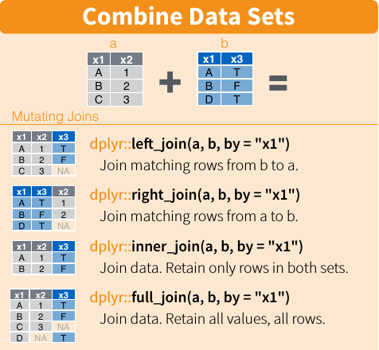

```{r, echo = F, message = F, warning = F}
library(dplyr);library(stringr);library(magrittr)
iris_setosa <- iris %>% filter(Species == "setosa")
iris_versicolor <- iris %>% filter(Species == "versicolor")
iris_virginica <- iris %>% filter(Species == "virginica")
```

# Introduction

In this second of SUSA's crash courses on R programming, you will learn about how to actually use R to conduct data analysis, or more appropriately, how to *clean* your data to prepare them for data analysis. You will continue your foray into R packages with this primer on `tidyverse`, a collection of packages meant to make data science in R rapid and painless. In particular, you will learn how to use `dplyr` and `tidyr` for data cleaning, `readr` and `readxl` for data import, and finally an introduction to R's functional tools, such as the `map` and `reduce` functions from the `purrr` package.

## About this Document
### Prerequisites
The immediate prerequisite this tutorial is [r1](r1.html). You will also need to install both R and RStudio to use the [r2-workbook](r2-workbook.Rmd) associated workbook. Visit [r0](r0.html) for general information on the philosophy and functionality of R and RStudio, as well as installation guides for both.

### r2
This document contains textbook-style information on R programming. It will cover the essentials of several `tidyverse` packages such as `dplyr`, `tidyr`, `readr`, `readxl`, and `purrr`.

Throughout this tutorial, you will be working with three distinct datasets, to give you familiarity and practice with the `tidyverse`. These datasets are as follows:

1. `iris`, the Edgar Anderson's classical multivariate dataset on 150 flowers in a Canadian field. This dataset will be used to illustrate `dplyr`, `tidyr`, `purrr` functions.
2. `articles`, an unclean dataset of Wellcome Trust's open access spend from 2012 to 2013. This dataset will be used to give readers practice with `dplyr` and even [`r1`'s `stringr` section](r1.html#stringr).  
2. `plant-ants`, an untidy matrix of plant-ant interactions recorded in 1996. This dataset will be used to give readers practice with `tidyr` and `readxl`. 

### r2-workbook
The [r2-workbook](r2-workbook.Rmd) contains associated exercises to work through as you learn about the concepts within this document. They are aimed to help you get practice and familiarity with R programming concepts and functions. At the end of each section of this document, solve the problems in the matching section of the workbook to help your understanding of the material.

# The `tidyverse` Ecosystem

Before we begin learning about the various packages contained within the `tidyverse` collection, it's important to conceptually understand what `tidyverse` aspires to do.

## Introduction

According to the [official website](https://www.tidyverse.org/),  

> The tidyverse is an opinionated collection of R packages designed for data science. All packages share an underlying design philosophy, grammar, and data structures.

Let's unpack this a little. The `tidyverse` is a collection of R packages. These R packages all share the same underlying data structures, grammar, and philosophy, and so are designed to *work well together*. Finally, the `tidyverse` is designed for data science. It aspires to make data science in R rapid, intuitive, and cohesive. 

As you will see throughout the rest of this tutorial, the packages in the `tidyverse` each cover separate areas of data science, but work so well together that you will find yourself tying them together into a single seamless workflow. This natural tendency to begin piping `readr` commands into `dplyr` commands into `broom` commands into `ggplot2` commands (the list could go on and on!) is exactly an artifact of the underlying philosophy and grammar pioneered by the `tidyverse`. 

> The bottom-line: The tidyverse is designed to make data science as human as possible.

## Installation

Installing every package in the canonical `tidyverse` takes only a single command:
```{r, eval = F}
install.packages("tidyverse")
```

From there, you can load the `tidyverse` packages into your work environment with:
```{r, message=T}
library(tidyverse)
```

Notice the output message, which tells you which specific packages of the tidyverse were loaded. 

While we're at it, let's also make sure `magrittr` is loaded into our environment too:
```{r}
library(magrittr)
```

# Data Wranging

The first general topic we will cover in this tutorial is **data wrangling**. **Data wrangling**, or manipulating dataframes, has two components: **data cleaning** and **tidying**. While you may wrangle your dataframe for a variety of purposes (e.g. changing the units of your variables or selecting only part of your dataset), they usually fall into one of those two broader categories. 

Unfortunately for all data scientists, statisticians, and machine learning specialists, in the wild, real datasets are ugly. There are missing values, random whitespace where you would never guess it, typos, annoying header cells, and more! You cannot analyze or even visualize your data while it's still "dirty". **Data cleaning** is the process of massaging your data into an error-free form (usually tidy) that works best for your analysis. As you'll soon learn in your Statistics career,

> 80% of your time working with data is spent cleaning.

*Cleaning* data is one thing (hint: `dplyr`'s got your back!), and involves a lot of time and care, but *tidying* data is still more stringent. As you'll learn next week in `r3`, the `tidyverse` runs on **tidy data**. Its functions are optimized to work seamlessly with any clean dataset, as long as the dataset is tidy.

A **tidy dataset** has two (loose) properties:  

1. Every observation is a single row.
2. Every variable is a single column.


While interpretations of **observation** and **variable** vary, it helps to know that tidy data is the antonym of **wide data** - tidy dataframes tend to be longer, rather than wider. For example, if you're working with a monthly-resolution time series of restaurant sales data, the **wide** dataset would have a row for each year, and a column for each month. The **tidy** dataset equivalent would have three columns: one for the year, one for the month, and one for the sales for that month. 

A diagram of tidy data, from RStudio's [Data Wrangling](https://www.rstudio.com/wp-content/uploads/2015/02/data-wrangling-cheatsheet.pdf) might be useful:


Just as the `dplyr` is specialized for manipulating data, The `tidyr` package is specialized to take cleaned data and output its tidy equivalent. Without further ado, let's learn how to use these powerful `tidyverse` packages!

## `dplyr`

`dplyr` is the `tidyverse` package for data manipulation. First, let's do a quick review of dataframes with the simple functions to help view data.

### `head`, `View`, `arrange`

The `head` function is useful to just see the first few entries of a dataframe. Let's use `head` to print the first six lines of `iris`, one of R's default datasets. 
```{r}
head(iris)
```

If you look at the documentation for `head` with `?head`, you can verify that the default number of lines outputted is 6. 

Rather than printing the dataframe to the console, the `View` function (*note the capital `V`!)* will open up a new pane in RStudio to view your dataframe as a spreadsheet, and also displays additional information like the number of observations (rows) and variables (columns). This pane is filterable and searchable, so it's useful to quickly glance through large datasets! Let's view our iris dataset in full:
```{r, eval = F}
View(iris) ## Run this command in your R Console!
```

Although you can sort your dataset in the View pane, suppose you want to sort your dataframe before using `head` to see the first six entries *by some column*. This is where `dplyr`'s sorting function comes in, `arrange`. By default, it will arrange your dataframe from least to greatest of some column variable. For example, let's check the shortest petals in the `iris` dataset:
```{r}
iris %>% arrange(Petal.Length) %>% head
```

If we wanted to check the **longest** petals instead, we would run:
```{r}
iris %>% arrange(desc(Petal.Length)) %>% head
```

`arrange` is the first of the `dplyr` functions we've learned. Now that we're warmed up, lets tackle the rest.

### Dataframe Subsetting

One of the most essential operations in data science is to select some subset of either the columns or the rows of a dataset. 

#### Row Selection (`sample_*`, `slice`, `filter`)

First, we'll learn how to select only certain rows in a dataset, either randomly, by row number, or according to a logical expression.

##### `sample_n`, `sample_frac`

To randomly select a few rows from your dataset, use `sample_n`, which takes a dataframe and a number of entries to sample. There's also `sample_frac`, which takes a dataframe and a fraction of the size of the dataframe to sample. Observe the following behaviors:
```{r}
iris %>% sample_n(size = 5)
## NOTE: iris has 150 entries. 33% of 150 is ~50.
iris %>% sample_frac(.33) %>% nrow
iris %>% sample_n(50) %>% nrow
```

##### `slice` 

To select a row by its row number, we used the `slice` function. `n` is a helper function that returns the number of entries in whatever is passed to the function it is used in. Observe the following behaviors:
```{r}
iris %>% slice(c(1,2,3,100,150))
iris %>% slice((n() - 3):n())
```

##### `filter`

What if you wanted all the entries in your dataframe that satisfied certain properties? `filter` is a `dplyr` verb that takes in a dataframe and any number of logical expressions about the dataframe's columns. Observe the following behaviors:
```{r}
iris %>% filter(Sepal.Width < 2.5)
iris %>% filter(Sepal.Width < 2.5, Species != "versicolor")
```


#### Column Selection (`select`, `rename`, `pull`)

Next, we'll learn how to `select` specific columns, rather than rows, of our data. We will also learn how to `rename` columns, and how to extract singular columns as vectors rather than sub-dataframes with `pull`.

##### `select`

`select` accepts a dataframe and one or more column names, and returns a new dataframe with just those columns. Apart from giving the exact column names you want, `select` also uses several helper verbs, like `ends_with` and `contains`. You can read about these verbs with `?starts_with`. Observe the following behaviors:
```{r}
iris %>% select(Species, Petal.Width, Petal.Length) %>% head
iris %>% select(starts_with("Petal")) %>% head
iris %>% select(- Species) %>% head
```

##### `rename`
You can also use `select` to rename columns as you select them. Observe the following behaviors:
```{r}
iris %>% select(`Species Name` = Species) %>% head
iris %>% select("Species Name" = Species, everything()) %>% head
```

However, if you don't want to specify that you want `everything` after you list your renamed columns, you can use the `rename` function, which has the same syntax as `select` but includes all of the other columns as well. The following command is nearly equivalent to the previous command:
```{r}
iris %>% rename("Species Name" = Species) %>% head
```


##### `pull`
Importantly, note that `select` returns a dataframe, not a vector. If we wanted to extract just a single column from a dataframe as a vector, we can use the `pull` command. Observe the following behaviors:
```{r}
iris %>% select(Petal.Width) %>% str()
iris %>% pull(Petal.Width) %>% str()
```

### Adding & Modifying Columns (`mutate`, `transmute`)

We now know how to subtract and rename columns from dataframes, but what about adding new ones? In this section, we'll learn about `mutate`, `dplyr`'s general function for modifying or adding columns, and its close cousin, `transmute`. 

#### `mutate`

`mutate` will apply a **window function** to every row of particular columns in a dataframe. A **window function** will output a row for every row passed to it.

`mutate` is used for two extremely common use cases. The first use for `mutate` is to modify existing columns. For example, suppose we wanted to view the `iris` dataset, but wanted to capitalize the species names. Observe the following behavior:
```{r}
iris %>% head(3)
iris %>% mutate(Species = toupper(Species)) %>% head(3) ## Still ugly...
tocamelcase <- function(str) {
  str_sub(str, 1, 1) <- str_sub(str, 1, 1) %>% toupper
  return(str)
}
iris %>% mutate(Species = tocamelcase(Species)) %>% head(3) ## Much better :)
```

The second usecase of `mutate` is to add new columns. Suppose we wanted to compute the `Total.Length` of the flowers in `iris`, which is the sum of their `Petal.Length` and `Sepal.Length`. The new columns will be appended to the right by default. Observe the following behavior:
```{r}
iris %>% mutate(Total.Length = Petal.Length + Sepal.Length) %>% head(3)
```

#### `transmute`

A close cousin of `mutate` is `transmute`, which essentially does a `mutate` and then only `select`s the columns you mutated. You can also forcibly include columns by just having them as arguments without assignments. Observe the following behavior:
```{r}
iris %>% transmute(Petal.Length, Sepal.Length, Total.Length = Petal.Length + Sepal.Length) %>% head(3)
```

### `summarise`, `summary`

A very common operation in data science is computing **statistics**, or **summary functions** of data. Some example **summary functions** include mean, median, mode, max, and min. The `dplyr` verb for computing summary statistics for a dataframe is `summarise`. For example, suppose we wanted to know the average petal and sepal lengths in `iris`. Observe the following behavior:
```{r}
iris %>% summarise(`Average Petal Length` = mean(Petal.Length), 
                   `Average Sepal Length` = mean(Sepal.Length))
```

Just of note, there's another function in base R called `summary` that seems similar to `summarise` but is actually completely different. Just as `View`, `head`, and `str` can be used to quickly glance at a dataset, `summary` accepts a dataframe and returns a print statement of summary statistics for each column, for human use. For `numeric` columns, it will give the **five-number summary** of the distribution of that column. For `factor` columns, it will give the counts of each `factor. Observe the following behavior:
```{r}
summary(iris)
```

### Grouped Data

While computing statistics is somewhat useful for whole datasets, we are often faced with questions about statistics *for particular groups* in our data. For example, we may wish to know the mean petal length for setosa, virginica, and versicolor (the `mean` for each `Species`) flowers. To condition by a particular variable, use the `group_by` function. Then, functions like `summarise` and `mutate` will apply **per group** rather than to the entire dataset at once. Observe the following behaviors:
```{r}
str(iris)
grouped_iris <- iris %>% group_by(Species)
str(grouped_iris)
```

As you can see from the output above, there's a few new properties in our `grouped_iris` dataframe, like `group_sizes` and `labels`. You can also group by multiple variables at once, by passing multiple arguments into `group_by`. Finally, you can un-group a grouped dataframe by simply passing it through the `ungroup` function.

#### Grouped `summarise`

When paired with `summarise`, grouped data will apply the **summary function** *per group*, outputting a **single row per group**. Observe the following behavior:
```{r}
iris %>%
  group_by(Species) %>%
  summarise(`Average Petal Length` = mean(Petal.Length), 
            `Average Sepal Length` = mean(Sepal.Length))
```

#### Grouped `mutate`

When paired with `mutate`, grouped data will apply the **window function** *per group*, outputting a **row for each row in the original datset**. Observe the following behavior:
```{r}
iris %>% group_by(Species) %>%
  mutate(`Petal Length Percentile within Species` = percent_rank(Petal.Length) %>% round(2)) %>% 
  select(Species, Petal.Length, `Petal Length Percentile within Species`) %>% sample_n(3) ## Notice: sample_n is for each group!
```

### Combining Datasets

At this point, we've covered all the essential `dplyr` verbs used to manipulate and transform individual datasets. But what if we wanted to combine datasets? 

For example, suppose we had three separate dataframes with the same column variables, and wanted to combine them into a single dataset. `dplyr`'s `bind_*` functions are useful here. 

Alternatively, suppose we had two dataframes that share a single column, and we wanted a new dataframe that encapsulated the columns in both in a single dataframe. `dplyr`'s `*_join` functions are useful here.

#### Binds

Suppose rather than having a single `iris` dataset, we had three distinct datasets, one for each group, as so:
```{r}
head(iris_setosa, 3)
head(iris_virginica, 3)
head(iris_versicolor, 3)
```

If we wanted to **bind** these together into a single dataframe, we first notice that we want to combine *rows*, not *columns*. Observe the following behavior:
```{r}
bind_rows(iris_setosa, iris_virginica, iris_versicolor) %>% sample_n(size = 10)
```

If we instead **binded** the *columns* together, we would see the following behavior:
```{r}
bind_cols(iris_setosa, iris_virginica, iris_versicolor) %>% str
```

#### Joins
The other class of functions that combine datasets together are the `*_join` family. A **join** will align two datasets based on one or more **key columns**, then combine them together. There are a variety of different joins. I find that the differences are best illustrated visually. Look over this diagram from RStudio's [Data Wrangling Cheatsheet](https://www.rstudio.com/wp-content/uploads/2015/02/data-wrangling-cheatsheet.pdf):


As a simple example of a join, suppose we had two dataframes:
```{r}
worker_hours <- data.frame(Name = c("Alex", "Bridgett", "Cooper"), Shift = c("Day", "Day", "Night"))
worker_hours
worker_pay <- data.frame(Name = c("Cooper", "Alex", "Bridgett"), Pay = c(12.5, 15, 14))
worker_pay
```

Obviously, these two dataframes are talking about the same people, but are in different orders. A `bind_cols` won't quite work out-of-the-box. Here's where `join` is useful:
```{r}
full_join(worker_hours, worker_pay)
## More specifically,
full_join(worker_hours, worker_pay, by = c("Name"))
```

By default, `dplyr` will try to guess which columns you are joining by, joining by columns with matching names automatically. Since this is the default behavior for joins, this is known as a **natural join**.

## `tidyr`

Now that you're all caught up on `dplyr`, let's look at its sister package, `tidyr`. `tidyr` also has functions to clean data, but its primary focus is on tidying data. Recall from the introduction of this section that **tidy data** has two properties:

1. Every observation is a single row.   
2. Every variable is a single column.   

Let's illustrate the difference between **tidy** and **wide** data with a couple of examples:
```{r, echo = F}
tidy_dataset <- data.frame(
  Year = 2015:2017 %>% rep(each = 12),
  Month = c("Jan", "Feb", "Mar", "Apr", "May", "June",
            "July", "Aug", "Sep", "Oct", "Nov", "Dec") %>% rep(times = 3) %>% 
    factor(ordered = T, levels =  c("Jan", "Feb", "Mar", "Apr", "May", "June",
            "July", "Aug", "Sep", "Oct", "Nov", "Dec")),
  `Stock Price` = rnorm(36, 100, 10), check.names = F)
wide_dataset <- tidy_dataset %>% spread(Month, `Stock Price`)
```

```{r}
head(wide_dataset)
str(wide_dataset)
head(tidy_dataset)
str(tidy_dataset)
```

Tidy data is very desirable for `tidyverse` functions because tidy data works best with concepts such as grouping, window functions, and the grammar for `ggplot2`, which we will learn next week.

### `gather`

`gather` is how you get from wide data to tidy data. `gather` will gather columns to instead treat them as rows. The syntax for `gather` is `df %>% gather(key, value, ...)`. The `key` is the name of the first of the new columns, which will hold the current column names. The `value` is the name of the second of the new columns, which will hold the information associated with the current column names. Finally, the `...` represents the columns you wish to pull down into rows. 

This is best illustrated with an example. Let's turn `wide_dataset` into `tidy_dataset`:
```{r}
tidy_dataset_2 <- wide_dataset %>% gather("Month", "Stock Price", - c("Year")) # Gather every column that is NOT Year  
head(tidy_dataset_2)
```

### `spread`

The inverse of the `gather` function is `spread`. In other words, `spread` is how you get from tidy data to wide data. `spread` will take rows and spread them up on-top as column names. The syntax for `spread` is similar to `gather`: `df %>% spread(key, value)`. The `key` is the column which you wish to spread as column names. The `value` is the column you want to use to fill up the new columns you're making. 

Again, this is best illustrated with an example. Let's turn the `tidy_dataset` into the `wide_dataset`:
```{r}
wide_dataset_2 <- tidy_dataset %>% spread(Month, `Stock Price`)
head(wide_dataset_2)
```

### NA Values

`tidyr` also contains a useful function for dealing with `NA` values. `NA` stands for *Not Available*. `NA` is used to denote missing values in datasets. For example suppose we had a dataset that was missing some values:
```{r, echo = F}
missing_dataset <- data.frame(Name = c("Alice", "Bob", "Catherine", "David", "Esther"), Age = c(23, 20, NA, 19, NA))
```
```{r}
missing_dataset
```

In this dataset, we don't know the ages of Catherine and Esther! `NA` values are annoying to deal with, becuase they are **infectious** - any operation with an `NA` value, with the exception of `is.na`, will return `NA`, no matter what. Keeping too many `NA` values in your dataset may infect your outputs of `mutate` or `summarise` to also be `NA`.


#### Using `tidyr` (`drop_na`)

One common approach to `NA` values is to simply remove them. This is very easily accomplished with `tidyr`'s `drop_na` function. Observe the following behavior:
```{r}
missing_dataset %>% drop_na()
```

#### Using `dplyr` 

The behavior of `drop_na` can be emulated with `filter` and the predicate `is.na`. Observe the following behavior:
```{r}
missing_dataset %>% filter(! is.na(Age))
```

# Data Import 

Phew! That was a lot of functions to cover, but hopefully you should have down the essentials to tackle most data cleaning and manipulation tasks. Now, let's talk about how to import your (probably dirty) data into R. 

## `readr` & `readxl`

The `tidyverse` contains two packages for importing data files into R as dataframes. The first is `readr`, used for most general file formats, including **CSV** (*comma-separated value files*) and **TSV** (*tab-separated value files*) files. The second is `readxl`, which is specialized for reading Excel spreadsheets, and includes optional arguments to only read specific regions and sheets.

The syntax for `readr`'s various `read_*` functions is pretty standard across all file types. For whatever file you're importing, check the documentation for that filetype. As an example, check the documentation for `read_csv` in you R Console with `?read_csv`. Some remarks on the more useful arguments:

- `file`: The (relative or absolute) path to the file you want to import as a dataframe   
- `col_names`: If `TRUE` (default) will interpret the first line as the names of the columns. If `FALSE`, will name them `X1`, `X2`, etc. automatically. If a vector of strings is passed instead of a logical value, will use those as column names.    
- `na`: What values should be converted into `NA` upon import?   
- `skip`: Some CSV's start with the first few lines as a description of the dataset, rather than the dataset itself. Use this argument to skip entire lines from your CSV when importing into a dataframe.    
- `n_max`: Sometimes, you only want the first few rows. Use `n_max` to tell `readr` how many rows you want to keep in your outputted dataframe.

The syntax for `readxl`'s `read_excel` is very similar to that of the `read_*` functions. By default, `read_excel` will try to guess if you're reading an `.xls` or `.xlsx` file by reading the file extension. Read the documentation of `read_excel`. Some remarks on the more useful arguments:

- `sheet`: Since some Excel spreadsheets contain multiple sheets, this can be either the name of the sheet you want or its position (e.g. 1, 2, 3, etc.)
- `range`: If you simply want a particular **range** (*rectangular region of cells*) from your sheet, you can specify it with a notation like `"B3:D87"`, which will cover all cells with rows `3:87` and columns `B, C, D`. This takes precedence over `skip` and `n_max`.

## Column Types

You'll notice I left out `col_types` in the remarks above. The `col_types` argument is usually a confusing argument for new users of `readr` and `readxl`, so this entire section is dedicated to explaining how it works!

By default, `col_types = NULL`, and `readr` will try to *guess* the correct types for each column by reading a few rows in each column. However, it's not always correct in its guess.

One common problem is `readr` getting confused between `factors` and `characters`. Recall that a **factor** is a type that refers to categorical data with a finite number of categories. R prefers to work with factors over strings if possible, as it makes checking equality and sorting faster than if it had to parse strings. `readr` will implicitly convert strings into factors by default. However, that isn't always desirable. 

To specify which column types you want for each column, use the `cols` and `col_*` helper functions. An example usage looks like this:
```{r, eval = F}
read_csv("somedataset.csv", col_names = c("A", "B", "C"), col_types = cols(A = col_double(), B = col_date(), C = col_guess()))
```

Alternatively, you could skip using the `cols` function altogether and just pass a string of single letters, each representing a `col_*` function. This is the abbreviated, but equivalent command for the same command above:
```{r, eval = F}
read_csv("somedataset.csv", col_names = c("A", "B", "C"), col_types = "dD?")
```

Here is a quick tablular summary of all of the different column types and their equivalent `col_*` functions and abbreviations:

| Data Type | `col_*` Function | String Abbreviation |
|----------:|:----------------:|:------------:|
| guess     | `col_guess`      | "?"          |
| character     | `col_character`      | "c"          |
| integer     | `col_integer`      | "i"          |
| number     | `col_number`      | "n"          |
| double     | `col_double`      | "d"          |
| logical     | `col_logical`      | "l"          |
| Date     | `col_date`      | "D"          |
| factor     | `col_factor`      | N/A         |
| skip     | `col_skip`      | "-"          |

# Functional Programming in R (`purrr`)

Now that we've reviewed the essentials data wrangling and data import, we're going to cover one last topic - **functional programming** in R. **Functional programming** is the paradigm that relies on applying **functions** to **elements** in multi-element structures. As we've seen so far, R has many multi-element structures, including vectors, lists, and dataframes. Because so much of data science relies on algorithms that *"for each X, do Y"* or *"for each X, compute f(X)"*, R contains a bunch of functions designed for functional programming. Known as the `apply` family, it consists of functions like `mapply`, `tapply`, `sapply`, and `lapply`. However, as with dataframe manipulation and data visualization, the `tidyverse` has packages that make things even easier. In this section, we will give a brief primer on `tidyverse`'s functional programming library, `purrr`.

## The `map` Family

The basic syntax of the `map` family is that they take a collection of elements (e.g. a list), apply a function to each one, and then return the new collection of elements. For example, suppose you had a list of three-element vectors each representing quadratic polynomials. You know the general Quadratic Formula for finding the larger root, and you wish to find the larger root of each one, without copying-and-pasting or doing it all manually. This is where the `map` family comes in.

### `map`

As a simpler problem, suppose we had a list of vectors and wanted to find the maximal value of each one. With `map` that's easy! `map` accepts a list and a function, and returns a **list** where the function was applied to each element. Observe the following behaviors:
```{r}
my_vecs <- list(
  c(1,5,4), 
  1:10,
  13:300,
  c("r" = 15, "s" = 9, "t" = 6, "u" = 1, "d" = 25, "o" = 6)
)
str(my_vecs)
map(my_vecs, max) ## applies `max` to each element of `my_vecs`
```

### `map_int`, `map_dbl`, `map_lgl`, `map_chr`

Hmmm... `map` always returns a **list**. But wouldn't it be better if our output this time was a numeric vector? Since they're all of the same type and the output looks flat anyway. 

To return a vector rather than a list, use the `map_*` functions. In this case, since we want our output to be a `numeric` vector, we use `map_dbl`:
```{r}
map_dbl(my_vecs, max) ## Much cleaner in than `map` in this case
```

Here is a quick tabular summary of the more common `map_*` functions:

| `map` Function | Input Type | Output Type |
|---------------:|:----------:|:-----------:|
| `map`     |    list, vector   | `list`  |
| `map_lgl` |    list, vector   | `logical` vector  |
| `map_int` |    list, vector   | `integer` vector  |
| `map_dbl` |    list, vector   | `double` vector  |
| `map_chr` |    list, vector   | `character` vector  |

There are many more functions related to `map`. Run `?map` in your R Console to check them out!

## More `purrr`

`purrr` is an extremely versatile package with dozens of functions. We cannot cover them all here, but I'll touch upon a couple to give you a flavor of what `purrr` is used for.

### `reduce`
If you want to *cumulatively* apply a function to each element of a list or vector, use the `reduce` function. By default, `reduce` will apply an operation repeatedly to the list, from left to right. `reduce_right` is a version of `reduce` that instead combines from right to left. Mathematically, `reduce(x, f)` will return $f(f(f(x_1, x_2), x_3), x_4)...) $. Observe the following behavior, where `reduce` is used to do interative subtraction:
```{r}
v <- 6:1
reduce(v, subtract)
# 6 - 5 - 4 - 3 - 2 - 1 = -9
```

If you ever have a list of dataframes, and want to apply the same combining function to all of them, `reduce` works here too! Observe the following behavior:
```{r}
iris_dfs <- list(iris_setosa, iris_virginica, iris_versicolor)
iris_dfs %>% reduce(bind_rows) %>% sample_n(10)
```

### `walk`

Suppose you want to print the length of each element of a nested list. `walk` will conduct a function on each element of a list, just like `map`, but does not return anything. Observe the following behavior:
```{r}
complicated <- list(
  c(1,2,3),
  3:1,
  list("pink", 
       "blue", 
       "susa",
       "colors"),
  list(1:100, 100:10, 10:1, "hello", "CX!", "world")
)
walk(complicated, function(element){print(length(element))})
```

# Conclusion

This ends our textbook-style tutorial on `dplyr`, `readr`, and other `tidyverse` packages. For more practice, check out [the mini-projects](r2-workbook.Rmd#mini-projects) section of `r2-workbook`.

## Sneakpeek at `r3`
Next week, we will be covering my personal favorite topic, data visualization in R with `ggplot2`! You will continue practicing **tidying** your data for effective piping into `ggplot2` functions. We will also cover the first of our machine learning algorithms in R, **linear regression** using the `lm` function and the `broom` package.

# Additional Reading
* The premier free online textbook for R, written by one of the leading developers of the R ecosystem, ["R for Data Science" can be found here](http://r4ds.had.co.nz/).
* The follow-up textbook to ["R for Data Science"](http://r4ds.had.co.nz/), ["Advanced R", can be found here](http://adv-r.had.co.nz/).
* RStudio hosts a [collection of cheatsheets](https://www.rstudio.com/resources/cheatsheets/) designed to make referencing `tidyverse` and other packages more visual. The relevant sheets to this tutorial are:     
    - [Data Wrangling Cheatsheet](https://www.rstudio.com/wp-content/uploads/2015/02/data-wrangling-cheatsheet.pdf): Contains information on `dplyr` and `tidyr` functions as applied to manipulating dataframes    
    - [Data Import Cheatsheet](https://github.com/rstudio/cheatsheets/raw/master/data-import.pdf): Contains information on `readr` and `tidyr` functions as applied to reading and cleaning data   
    - [Functional Programming Cheatsheet](https://github.com/rstudio/cheatsheets/raw/master/purrr.pdf): Contains information on the `*apply` family as well as `purrr`   
    - [String Manipulation Cheatsheet](https://github.com/rstudio/cheatsheets/raw/master/strings.pdf): Contains information on the `stringr` package for text manipulation    
* For a detailed official guide on R, see the first three manuals on [this CRAN page](https://cran.cnr.berkeley.edu/manuals.html).
* For more information on the `tidyverse` packages, visit the official [tidyverse package listing](https://www.tidyverse.org/packages/).  
* For an interactive guide to learning R and Python, visit [DataCamp](https://www.datacamp.com/) a paid tutorial website for learning data computing.
