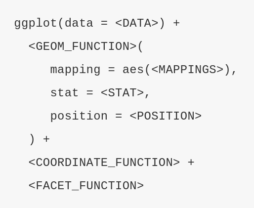

```{r, echo = F, message = F, warning = F}
library(dplyr);library(stringr);library(magrittr)

```

# Introduction

In this last of SUSA's crash courses on introductory R programming, we will round out the data manipulation skills learned in `r2` (on data cleaning, which, if you recall, captured $\sim 80\%$ of data science) with the fun part - data analysis! In this tutorial, you will learn how to use `ggplot2`, R's premier data visualization library, to conduct **EDA** (*exploratory data analysis*) and display data in visually powerful ways. You will also learn our first machine learning algorithm, **linear regression**, a classical method in statistical analysis. You will learn how to verify the assumptions of the linear regression model, how to interpret its results, and even how to use and tune more complex regressions like **ridge regression** and **polynomial regression**.

## About this Document
### Prerequisites
The immediate prerequisite this tutorial is [r2](r2.html), which covers several `tidyverse` packages used for data cleaning. You will also need to install both R and RStudio to use the [r3-workbook](r3-workbook.Rmd) associated workbook. Visit [r0](r0.html) for general information on the philosophy and functionality of R and RStudio, as well as installation guides for both.

### r2
This document contains textbook-style information on R programming. It will cover the essentials of data visualization with `ggplot2` and an introduction to statistical analysis and inference with an overview of linear regression in R.

Throughout this tutorial, you will be working with three distinct datasets, to give you familiarity and practice with the `tidyverse`. These datasets are as follows:

1. `iris`, the Edgar Anderson's classical multivariate dataset on 150 flowers in a Canadian field. This dataset will be used to illustrate some of the `ggplot` functions.   
2. `diamonds`, a dataset containing the prices and various attributes of almost 54,000 diamonds. This dataset will be used to illustrate some of the `ggplot` functions.  
3. `mpg`, a subset of EPA's dataset on fuel economy, including the `hwy` fuel efficiency and other attributes of 234 automobiles from 1999 to 2008. This dataset will be used in the two mini-projects in [r3-workbook](r3-workbook.Rmd#mini-projects).

### r3-workbook
The [r3-workbook](r3-workbook.Rmd) contains associated exercises to work through as you learn about the concepts within this document. They are aimed to help you get practice and familiarity with R programming concepts and functions. At the end of each section of this document, solve the problems in the matching section of the workbook to help your understanding of the material.

# Data Visualization and Analysis

What is the purpose of data science anyway? I don't mean to get all philosophical on you, but it is important to have an understanding of the objectives of the data science paradigm as you learn data science techniques.

While you'd get different answers from different data scientists, here are the three main objectives that I have in the data science projects I embark upon:

### Objectives of Data Science
#### **Objective I:** Show humans what structures exist in the data.
#### **Objective II:** Use inference to make conclusions about the relationships and structures in the data.
#### **Objective III:** Use machine learning to make predictions about new, but similar, data.

The difference between your Statistics classes and data science in practice is that your Statistics classes are primarily focused on **Objective II** and **Objective III**. For example, STAT 135 & STAT 151A concern themselves primarily with statistical inference in the form of confidence intervals, hypothesis testing, and regression coefficient interpretation. STAT 154 and machine learning in general concerns itself with classification and prediction of new data points given prior data. 

In contrast, this workshop is concerned primarily with **Objective I**. Humans are visual creatures, and so while a computer is most able to interpret bytes of numbers and texts, humans would rather see data visually! A data scientist or statisticians requires the trust of their coworkers and managers and the public at large. Tables can be an information overload, and model paramatizations may be foreign to your audience. Graphs are one way we connect our *data* to the *people* who care about them. The other is statistical reporting, which can prove to be difficult without practice simplifying results without losing precision or accuracy.

##### Looking at *tabulations* of data is hard for **humans**, but easy for **computers**.   

##### Looking at *visualizations* of data is hard for **computers**, but easy for **humans**

Every data scientist relies on the audience's understanding of their work, whether their project manager or a client, and so effective data visualization and reporting skills are essential when presenting your findings. Even for a data scientist working on private research, data visualization is a powerful tool to view various aspects and relationships within the data, allowing for a deeper understanding of the underlying structure of data. 

Some examples of structures that are easily detectable by humans in graphical displays of data are:   
- Outliers  
- Clusters  
- Relationships between variables  
- Timed processes via animated plots  
- Spacial distributions via geolocational visualizations  

As you will see in the second part of this tutorial, models like **linear regression** come with a host of assumptions - some of which are most rapidly verified graphically. While the linear regression model is powerful, it doesn't work in all cases. Blindly applying models to data without exploring the data visually first (*EDA*) can lead to flawed model design and misinterpretation of results. Once you have a suspicion about the structure of the underlying distribution and patterns in the data, you can then use analysis to either predict new data with known certainty, or inferential statistics to assign quantatative interpretations to these structures. Plus, plotting data is fun! You can quickly pluck out insights in the data in ways that aren't as easily described quantitatively.

> “The greatest value of a picture is when it forces us to notice what we never expected to see.” — John Tukey

One last thought about data visualization - it's a craft, part technique and part creativity. Feel free to try various ways of displaying the same patterns in your behavior, and while there are some broad guidelines to effective visualization, a lot of it comes with instinctual creativity and practice.

# Data Visualization with `ggplot2`

`ggplot2` is R's premier library for data visualization. Although its syntax is quite different than the rest of base R and most packages, there's a method to the madness - `ggplot2` is backed by a  *grammar of graphics* that allows it to make any plot imaginable (within the constraints of its `geoms`). However, just because any plot is possible, doesn't mean every plot is good... Let's start by reviewing some essential tips for effective visual display of data.

## Tips for Data Visualization

First and foremost: tell a story! Data may seem very cold and neutral, but data are quantifications of behaviors in our world. Graphs are how we can make data less cold, and more interpretable for humans. Each graph should show something insightful, important, and easily detectable by the audience. Of course, the are a variety of ways to display the same patterns - the creative process of effective data visualization is choosing *how* to say the story best.

Some other tips for data visualization include:   
-  Minimize the **data-ink** ratio, or the amount of information you are showing per unit of "ink". You want to only include visual information relevant to your point for that specific graph. If you can't get rid of irrelevant details without the graph looking sparse, consider highlighting the patterns, trends, or outliers you want the audience to concentrate on with color, sizing, or labels.   
- Include a (zero) **baseline**. Scales give the relative positions between various quantities, but if the audience has no idea what general context the numbers exist in, there's no point in comparing them. Often times, this means including `y = 0` or `x = 0` in your axis, rather than line breaking, which can be seen as intentionally misleading.   
- Communicative elements are a **must**. Whether this means simply axis and plot titles, rearranging your legend, or adjusting font sizes to show up better on a projector screen, it must be immediately obvious to a new viewer what your graph aims to display.   
- Keep engrained preconceptions of **colors** in mind. For example, it is generally inadvisable to use bright red to indicate positive trends. Additionally, be wary of color-blindness, which affects over seven percent of the American populace. Finally, use differentiating colors to highlight factors, sequential colors to highlight trends, and diverging colors to highlight splits in behavior. The [`RColorBrewer`](http://colorbrewer2.org/) package is an extension of `ggplot2` that allows you to easily switch between color themes specially designed for data visualization.    
* Order bars by height. Humans prefer things ordered, and it makes relative comparison between bars much more visible.   
* Never use pie charts. This is decreed by the legendary Edward Tufte, one of the founders of data visualization, who noted its imprecision for more than a couple categories or dimensions. Usually, bar charts are just better. Also, stay away from double-axis graphs - unless you *want* to mislead someone...

> “The only worse design than a pie chart is several of them,”  — Edward Tufte

## Vocabulary for Data Visualizations

* a **geom** is the visualization's representation of an aspect of a dataset, e.g. bars in a bar plot, or points in a scatterpoint. geoms have various **aesthetics** (*aesthetic properties*), like x-location, y-location, transparency, shape, and color, that can be mapped to variables in a dataframe   
* a **glyph** is the visual equivalent of a single datapoint, e.g. a single point in a scatterplot    
* a **layer** is a set of *glyphs* of the same *geom*, e.g. the collection of points in a scatterplot

## Abstractions of Data Visualization

The `gg` in `ggplot2` stands for *"Grammar of Graphics"*. `ggplot2` is the implementation of this idea that all data visualizations decompose into specific components, and so if we have a way to manipulate each component and then sum them together, we can make any plot!

The components used in the *layered grammar of graphics* underyling `ggplot2` are as follows:   
1) a base **dataset**, and a set of mappings from **variables** to **aesthetics**   
2) one or more **layers**, with each layer of **glyphs** having:  
    - one geometric object, or **geom**
    - (optionally) one statistical transformation  
    - (optionally) one position adjustment  
    - (optionally) an alternative dataset and set of aesthetic mappings  
3) a **scale** for each aesthetic mapping  
4) a **coordinate system**    
5) (optionally) **facet specification**  
6) **communicative elements** (labels, borders, titles, etc.)  

The basic idea is that we first construct an empty ggplot by specifying the dataset and mappings, then add layers of geometric objects, then alternative scales, coordinates, or faceting if we wish to deviate from the default, and finally communicative elements for human audiences, such as labels, subtitles, and grid lines.

To make this abstraction a little more relatable, imagine you are tasked to draw a scatterplot by hand for a Statistics class. First, you would $(1)$ decide on what **data** you would be plotting, and then draw the relevant **axes**. Then, you would $(2)$ plot a **layer** of points onto your page, $(3)$ choosing your position by whatever **scale** you set for each axis. If you were going to either use $(4)$ another **coordinate system** or $(5)$ some sort of **faceting**, you would also need to draw the graph accordingly. The final step would be to $(6)$ add axis labels, a title, and other **communicative elements**. 

As you could imagine, you could make up a similar recipe for any plot possible. Just like this analagy and the abstraction it illustrates, the syntactic structure of `ggplot2` is meant to mimic the actual modular creation of plots. We're going to drop this diagram here (*notice the similarity to the grammar above!*) for now, but we will be going into it in much more detail in the following section, on `ggplot2` basics!



## `ggplot2` Basics

## Modeling with `ggplot2`

# Data Analysis

## What is Regression?

## Linear Regression

## Polynomial Regression

## Model Selection with `broom`

# Mini-projects

There are two mini-projects for this tutorial, designed to give you practice with EDA and more advanced model selection. Find the full project specifications in the [mini-project section of the r3-workbook](r3-workbook.Rmd#mini-project).

## Exploratory Data Analysis

Exploratory Data Analysis (**EDA**) is the process of using summary data and data visualization to get a sense of the underlying structures within your data *before* analysis. It's a fairly creative process, and like most creative processes, the best way to learn how to do EDA effectively is with practice. In this mini-project, you will explore either either the `diamonds` or the `mpg` dataset, noting any unusual relationships or outliers. 

## Validation & Elastic Net Regression

Now that you're familiar with graphing with `ggplot2` and model selection with `broom`, try your skills at this fairly advanced graphing exercise with the `mpg` dataset. You will learn a new type of regression, **elastic net regression**, which has not one but two hyperparameters! You will use function definitions to **grid search** hyperparameters, construct a dataframe of various models for predicting the `hwy` of each car with `broom`, and finally graph your validation process with `ggplot2.`


# Conclusion

This ends our textbook-style tutorial on data visualization with `ggplot2` and an introduction into the first of our machine learning algorithms, linear regression with `lm` and `broom`. For more practice, check out [the mini-project](r3-workbook.Rmd#mini-project) section of `r3-workbook`.

## Sneakpeek at `advr1`
This marks the end of our introductory series into R programming! Congratulations on making it this far. By now, you should be able to begin your own foray into data cleaning, data visualization, and data analysis. Stay tuned in two weeks for `advr1`, the SUSA crash course introduction to neural nets in R!

# Additional Reading
* The premier free online textbook for R, written by one of the leading developers of the R ecosystem, ["R for Data Science" can be found here](http://r4ds.had.co.nz/). In particular, the [chapter on **data visualization**](http://r4ds.had.co.nz/data-visualisation.html) and [chapter on **data reporting**](http://r4ds.had.co.nz/graphics-for-communication.html) are especially helpful for this workshop.  
* The follow-up textbook to ["R for Data Science"](http://r4ds.had.co.nz/), ["Advanced R", can be found here](http://adv-r.had.co.nz/).
* RStudio hosts a [collection of cheatsheets](https://www.rstudio.com/resources/cheatsheets/) designed to make referencing `tidyverse` and other packages more visual. The relevant sheets to this tutorial are:   
    - [ggplot2 Cheatsheet](https://www.rstudio.com/wp-content/uploads/2015/03/ggplot2-cheatsheet.pdf)
    - [Data Wrangling Cheatsheet](https://www.rstudio.com/wp-content/uploads/2015/02/data-wrangling-cheatsheet.pdf): Contains information on `dplyr` and `tidyr` functions as applied to manipulating dataframes    
    - [Data Import Cheatsheet](https://github.com/rstudio/cheatsheets/raw/master/data-import.pdf): Contains information on `readr` and `tidyr` functions as applied to reading and cleaning data   
    - [Functional Programming Cheatsheet](https://github.com/rstudio/cheatsheets/raw/master/purrr.pdf): Contains information on the `*apply` family as well as `purrr`   
    - [String Manipulation Cheatsheet](https://github.com/rstudio/cheatsheets/raw/master/strings.pdf): Contains information on the `stringr` package for text manipulation    
* For more packages that are useful with `ggplot2`, check out:  
    - `ggthemr`  
    - `plotly::ggplotly`  
    - `ggmap`   
    - `sf`  
* For more information on the `tidyverse` packages, visit the official [tidyverse package listing](https://www.tidyverse.org/packages/).  
* For an interactive guide to learning R and Python, visit [DataCamp](https://www.datacamp.com/) a paid tutorial website for learning data computing.
